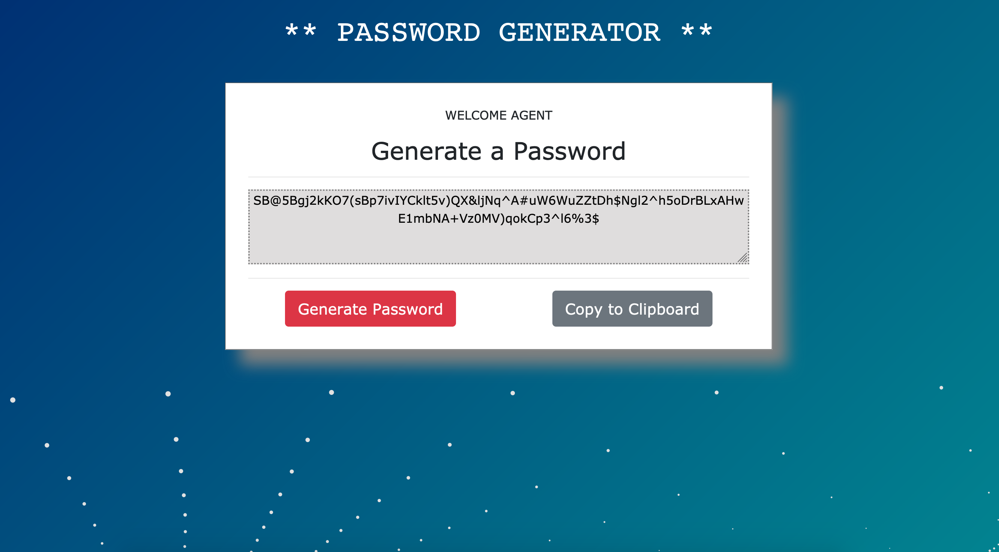

# Unit 03 JavaScript Homework: Password Generator

Wokring URL: https://n0matic.github.io/Password.Generator.io/

This is a Password Generator built for a homework assignment and as such, follows certain parameters:

## Description

"Create an application that generates a random password based on user-selected criteria. This app will run in the browser and feature dynamically updated HTML and CSS powered by your JavaScript code.

The user will be prompted to choose from the following password criteria:

* Length (must be between 8 and 128 characters)

* Character type:

  * Special characters

  * Numeric characters

  * Lowercase characters

  * Uppercase characters

The application should validate user input and ensure that at least one character type is selected.

Once all prompts are answered, the user will be presented with a password matching the answered prompts. Displaying the generated password in an alert is acceptable, but attempt to write the password to the page instead.

As a bonus, the user should also have the option to click a button to copy the password to their clipboard.

Your application should have a clean and polished user interface and be responsive, ensuring that it adapts to multiple screen sizes.

## Functionality

This Password generator works as follows:

 - When the user clicks on the Generate Password button they receive several prompts
 
 - The first requests a password length of between 8 and 128 characters.

 - Four subsequent prompts confirm Special, Numeric, Lowercase, and Uppercase characters.

 - Once these specifications are established, a password is randomly created and displayed in the appropriate textbox.

 - The "Copy to Clipboard" button can be pushed to copy the generated password to the clipboard.

 - That's it! The process can be repeated any number of times and with new parameters.

## Additional Details

An animated background was added via: "https://github.com/mrdoob/three.js"

It includes assets in both the CSS and jscript files.

## Functional Screenshot

